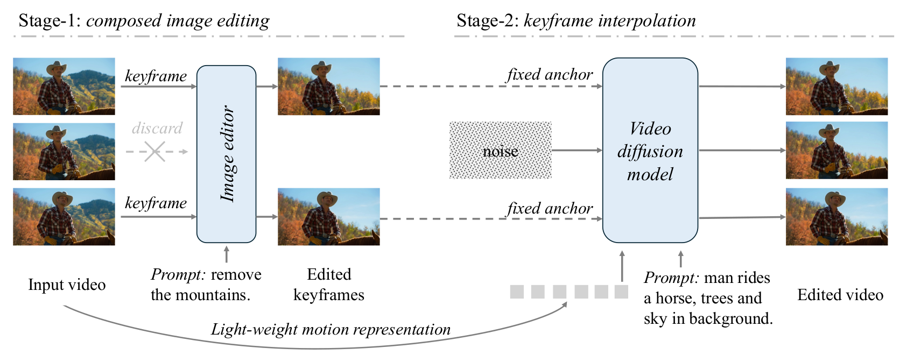

# AVE: Transforming Image Editors into Video Editors

**Transforming Image Editors into Video Editors**<br>
Feng Wang<sup>1,2</sup>, Zijie Li<sup>1</sup>, Ceyuan Yang<sup>1</sup>, Alan Yuille<sup>2</sup>, Peng Wang<sup>1</sup><br>
<sup>1</sup>ByteDance Seed &nbsp; <sup>2</sup>Johns Hopkins University<br>
**NeurIPS 2026**

<!-- TODO: [[Paper]](arXiv link) [[Project Page]](link) -->

---

## Introduction

Image editors are now much stronger than video editors. **AVE (Anchor-based Video Editing)** turns a strong image editor into a video editor without training an end-to-end video editing model. AVE splits video editing into two stages:

1. **Composed image editing.** AVE takes a few keyframes from the input video and edits them together with an image editor.
2. **Keyframe interpolation.** An image-to-video diffusion model (Wan2.2-I2V-A14B) generates the edited video, with the edited keyframes kept as fixed anchors.

Because the two stages are decoupled, a better image editor directly gives better video edits. AVE achieves strong results on IVEBench and VIE-Bench.

<p align="center">
  
</p>
<p align="center"><em>
Figure 1: Overview of our two-stage pipeline. In Stage-1, we edit a sparse set of keyframes using either open-source or API-based image editors. In Stage-2, an image-to-video diffusion model interpolates between the edited anchors while preserving the source motion via a lightweight motion encoder and anchor clamping.
</em></p>

## About This Release

This repository contains the **zero-shot version** of AVE. Due to company policy, **we cannot release any trained weights**. The lightweight motion encoder (and its control branch) and the fine-tuned multi-image editor described in the paper are not included. The released pipeline is training-free:

| Component | Paper | This release |
|---|---|---|
| Stage-1 image editor | Fine-tuned BAGEL or Nano Banana API | Nano Banana API (Gemini image model), all keyframes edited in one multi-turn chat |
| Stage-2 video model | Wan2.2-I2V-A14B + trained motion encoder | Wan2.2-I2V-A14B (frozen, no extra weights) with multi-anchor conditioning |
| Source motion | Motion encoder on source-video latents | Text prompt: Gemini writes a motion description from 16 frames of the source video |

The steps of the pipeline are:

1. **Keyframe extraction.** Take `N` evenly spaced keyframes from the input video, including the first and last frame. The default is `N = 3`.
2. **Composed image editing.** Edit all keyframes in one multi-turn conversation with a Gemini image model. Earlier edits stay in context, so style stays consistent across frames.
3. **Motion prompt.** A Gemini text model reads 16 frames of the *source* video together with the edit instruction. It writes a short prompt that describes the motion and camera movement of the *edited* video.
4. **Keyframe interpolation.** The output length matches the source duration at 16 fps, rounded up to `4n+1` frames. Edited keyframes are placed at evenly spaced frame indices, snapped to multiples of 4 (the VAE's temporal stride). Wan2.2 I2V then generates the frames in between.

### Multi-anchor conditioning

The original Wan2.2 I2V model conditions only on an image at frame 0. In `wan/image2video.py` we generalize this to any number of anchors:

- A binary mask marks **every** anchor frame.
- All anchor images are placed into a zero-filled video tensor at their frame indices. This tensor is VAE-encoded as the conditioning latent.

With a single anchor at frame 0, the code takes the original path, so standard I2V behaves exactly as before.

## Repository Structure

```
.
├── video_edit.py          # End-to-end single-video editing pipeline (entry point)
├── generate.py            # Anchor-conditioned video generation with Wan2.2 I2V-A14B
├── run_video_edit.sh      # Example launcher for video_edit.py
├── requirements.txt
├── assets/                # Figures; put example inputs here
└── wan/                   # Wan2.2 model code, reduced to I2V-A14B
    ├── image2video.py     # WanI2V pipeline (+ multi-anchor conditioning)
    ├── configs/           # I2V-A14B config
    ├── modules/           # DiT, T5 encoder, Wan2.1 VAE, attention
    ├── distributed/       # FSDP + Ulysses sequence parallel
    └── utils/             # Flow-matching solvers, video I/O
```

## Installation

### 1. Create an environment

Tested with Python 3.12, PyTorch 2.4.1 (CUDA 11.8), and flash-attn 2.6.3 on Linux.

```bash
git clone https://github.com/wangf3014/AVE.git
cd AVE

conda create -n ave python=3.12 -y
conda activate ave
```

### 2. Install PyTorch

Choose the wheel that matches your CUDA driver (see [pytorch.org](https://pytorch.org/get-started/previous-versions/)). For example:

```bash
# CUDA 11.8
pip install torch==2.4.1 torchvision==0.19.1 --index-url https://download.pytorch.org/whl/cu118
# CUDA 12.1
# pip install torch==2.4.1 torchvision==0.19.1 --index-url https://download.pytorch.org/whl/cu121
```

### 3. Install dependencies

```bash
pip install -r requirements.txt
```

### 4. Install flash-attention (required)

```bash
pip install flash-attn --no-build-isolation
```

If the build fails, install a prebuilt wheel for your Python / PyTorch / CUDA versions from the [flash-attention releases](https://github.com/Dao-AILab/flash-attention/releases).

### 5. Install ffmpeg (recommended)

`imageio-ffmpeg` includes its own ffmpeg binary for writing videos. A system ffmpeg is still useful for inspecting and converting results:

```bash
conda install -c conda-forge ffmpeg -y   # or: sudo apt install ffmpeg
```

### 6. Verify

```bash
python -c "import torch, flash_attn, wan; from google import genai; print(torch.__version__, torch.cuda.is_available())"
```

## Model Weights

AVE (zero-shot) uses the official **Wan2.2-I2V-A14B** checkpoint as-is. It is about 118 GB. No other weights are needed.

| Model | Hugging Face | ModelScope |
|---|---|---|
| Wan2.2-I2V-A14B | [Wan-AI/Wan2.2-I2V-A14B](https://huggingface.co/Wan-AI/Wan2.2-I2V-A14B) | [Wan-AI/Wan2.2-I2V-A14B](https://modelscope.cn/models/Wan-AI/Wan2.2-I2V-A14B) |

```bash
pip install "huggingface_hub[cli]"
huggingface-cli download Wan-AI/Wan2.2-I2V-A14B --local-dir ./Wan2.2-I2V-A14B
```

or

```bash
pip install modelscope
modelscope download Wan-AI/Wan2.2-I2V-A14B --local_dir ./Wan2.2-I2V-A14B
```

The directory should look like this:

```
Wan2.2-I2V-A14B/
├── high_noise_model/                     # MoE expert for high-noise steps (sharded safetensors)
├── low_noise_model/                      # MoE expert for low-noise steps (sharded safetensors)
├── google/umt5-xxl/                      # T5 tokenizer
├── models_t5_umt5-xxl-enc-bf16.pth       # T5 text encoder
└── Wan2.1_VAE.pth                        # VAE
```

> **Tip:** Loading the weights is limited by disk I/O. On a network file system, reading the ~118 GB checkpoint can take 20+ minutes per run. If possible, copy it to a local SSD or `/dev/shm` first.

## Gemini API Key

Stage-1 editing and motion prompt generation call the Google Gemini API. Create an API key in [Google AI Studio](https://aistudio.google.com/apikey) and export it:

```bash
export GEMINI_API_KEY=<your key>
```

You can also pass `--api_key <your key>`, but keep keys out of scripts and version control.

| Step | Default model | Flag |
|---|---|---|
| Keyframe editing | `gemini-3-pro-image-preview` (Nano Banana Pro) | `--image_edit_model` |
| Motion prompt | `gemini-2.5-flash` | `--text_model` |

Image generation models may require a billing-enabled API project.

## Quick Start

```bash
export GEMINI_API_KEY=<your key>

# Single GPU
python video_edit.py \
    --input_video ./assets/input.mp4 \
    --edit_prompt "Remove the dense vegetation around the elephant" \
    --ckpt_dir ./Wan2.2-I2V-A14B \
    --num_gpus 1 \
    --work_dir ./outputs/demo \
    --output ./outputs/demo/edited.mp4
```

```bash
# Multiple GPUs (launches torchrun with FSDP + Ulysses sequence parallel)
python video_edit.py \
    --input_video ./assets/input.mp4 \
    --edit_prompt "Remove the dense vegetation around the elephant" \
    --ckpt_dir ./Wan2.2-I2V-A14B \
    --num_gpus 8 \
    --work_dir ./outputs/demo \
    --output ./outputs/demo/edited.mp4
```

You can also set the variables at the top of `run_video_edit.sh` and run `bash run_video_edit.sh`.

To check the setup without calling the API or loading the model, add `--dry_run`. It prints the planned keyframes, the anchor mapping, and the exact generation command.

### Hardware

| Mode | How generation runs | Notes |
|---|---|---|
| `--num_gpus 1` | `python generate.py --offload_model True --convert_model_dtype --t5_cpu` | Fits a 48 GB GPU. On one RTX A6000 (480p, 65 frames): **~41 GB peak VRAM**, ~28 s per denoising step, ~20 min for 40 steps. Needs ~70 GB CPU RAM for the offloaded experts and T5. |
| `--num_gpus N` (N > 1) | `torchrun --nproc_per_node=N generate.py --dit_fsdp --t5_fsdp --ulysses_size N` | N must divide the 40 attention heads (e.g. 2, 4, 8). Much faster. |

### Outputs

```
<work_dir>/
├── original_keyframes/        # keyframe_000_srcframe0.png, ...
├── edited_keyframes/          # edited_000.png, ...   (the anchors)
└── pipeline_state.json        # video info, motion prompt, anchor indices, output size
<output>                       # final edited video (16 fps)
```

## Usage Details

### `video_edit.py` options

| Argument | Default | Description |
|---|---|---|
| `--input_video` | *(required)* | Source video |
| `--edit_prompt` | *(required)* | Editing instruction, e.g. `"Make it a snowy winter scene"` |
| `--num_keyframes` | `3` | Number of anchor keyframes, including first and last frame (minimum 2) |
| `--ckpt_dir` | `./Wan2.2-I2V-A14B` | Wan2.2 checkpoint directory |
| `--num_gpus` | `8` | `1` runs on a single GPU with offloading; `>1` uses torchrun |
| `--port` | `7559` | torchrun rendezvous port |
| `--size` | auto | `832*480` for landscape, `480*832` for portrait; `1280*720` / `720*1280` also supported |
| `--seed` | `42` | Generation seed (`-1` = random) |
| `--work_dir` | `./video_edit_workdir` | Folder for intermediate files |
| `--output` | `<work_dir>/edited_video.mp4` | Output video path |
| `--image_edit_prompt` | = `--edit_prompt` | Use a different instruction for keyframe editing |
| `--video_prompt` | generated | Skip motion prompt generation and use this text prompt |
| `--image_edit_model` | `gemini-3-pro-image-preview` | Gemini image model |
| `--text_model` | `gemini-2.5-flash` | Gemini text model |
| `--resume_from` | `1` | Resume from a step, reusing files in `work_dir` (`3` = re-edit frames, `4` = new prompt, `5` = generate only) |
| `--prepare_only` | off | Run keyframe editing and prompt generation only, without Wan generation |
| `--dry_run` | off | No API calls and no generation; print the plan and command |

### Common workflows

**Edit keyframes first, then generate later on a GPU machine:**

```bash
python video_edit.py --input_video in.mp4 --edit_prompt "..." --work_dir ./outputs/run1 --prepare_only
# ... inspect / fix ./outputs/run1/edited_keyframes/*.png ...
python video_edit.py --input_video in.mp4 --edit_prompt "..." --work_dir ./outputs/run1 --resume_from 5 --num_gpus 1
```

**Re-generate with a different motion prompt:**

```bash
python video_edit.py --input_video in.mp4 --edit_prompt "..." --work_dir ./outputs/run1 \
    --resume_from 5 --video_prompt "A robot walks forward along the street. The camera slowly tracks it."
```

### Using `generate.py` directly

`generate.py` takes any set of images as anchors. Use it if you edit keyframes with your own image editor:

```bash
# Single GPU
python generate.py \
    --ckpt_dir ./Wan2.2-I2V-A14B \
    --size 832*480 --frame_num 81 \
    --frame_images 0:frame_a.png 40:frame_b.png 80:frame_c.png \
    --prompt "A dog runs across the lawn from left to right. The camera pans to follow it." \
    --offload_model True --convert_model_dtype --t5_cpu \
    --save_file out.mp4

# 8 GPUs
torchrun --nproc_per_node=8 generate.py \
    --ckpt_dir ./Wan2.2-I2V-A14B \
    --size 832*480 --frame_num 81 \
    --frame_images 0:frame_a.png 40:frame_b.png 80:frame_c.png \
    --prompt "..." \
    --dit_fsdp --t5_fsdp --ulysses_size 8 \
    --save_file out.mp4
```

- `--frame_num` must be `4n+1`. Output is 16 fps, so 81 frames is about 5 s.
- Anchor frame indices must be in `[0, frame_num-1]` and should be **multiples of 4**, because the VAE compresses 4 frames into one latent.
- The output aspect ratio follows the first anchor image. `--size` sets the target pixel area.
- `--image img.png` is shorthand for `--frame_images 0:img.png`, which is standard image-to-video.
- Sampling defaults are 40 steps, shift 5.0, guidance scale 3.5, and the UniPC solver. Change them with `--sample_steps`, `--sample_shift`, `--sample_guide_scale` and `--sample_solver`.

## Known Limitations

Due to company restrictions, **we are unable to release any trained weights**. The lightweight motion encoder in the paper is not included, so this repository provides only the **pure zero-shot version** of AVE. In this version, Wan2.2 receives the source motion only through a text prompt. It does not see the source video's motion representation.

As a result:

- **Edits that change the whole scene can show some style drift.** For example, global style transfer or changing the weather or season of the entire scene. Without the motion encoder, the appearance between anchors is less constrained, and small differences between the edited keyframes can show up as a gradual shift in color or style over the video.
- **Local edits still work well.** These include **adding, removing, and modifying objects**. Here most of the scene is unchanged, and the edited keyframes alone constrain the interpolation well.

For global edits, inspect `edited_keyframes/` before generation. If one frame is inconsistent, fix or re-edit it and resume with `--resume_from 5`. Changing `--num_keyframes` can also help.

## Citation

If you find this work useful, please cite:

```bibtex
@inproceedings{wang2026transforming,
  title     = {Transforming Image Editors into Video Editors},
  author    = {Wang, Feng and Li, Zijie and Yang, Ceyuan and Yuille, Alan and Wang, Peng},
  booktitle = {Advances in Neural Information Processing Systems (NeurIPS)},
  year      = {2026}
}
```

## Acknowledgements

This project is built on [Wan2.2](https://github.com/Wan-Video/Wan2.2) by the Alibaba Wan Team. The `wan/` package and `generate.py` are derived from the official code: we reduced it to the I2V-A14B model and added multi-anchor conditioning. Keyframe editing and prompt generation use the [Google Gemini API](https://ai.google.dev/).

## License

This repository is released under the Apache 2.0 License (see [LICENSE](LICENSE)), following Wan2.2. The Wan2.2 model weights are subject to their own license terms.
